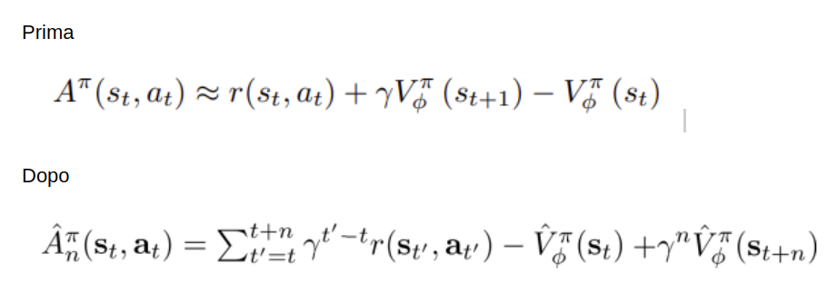
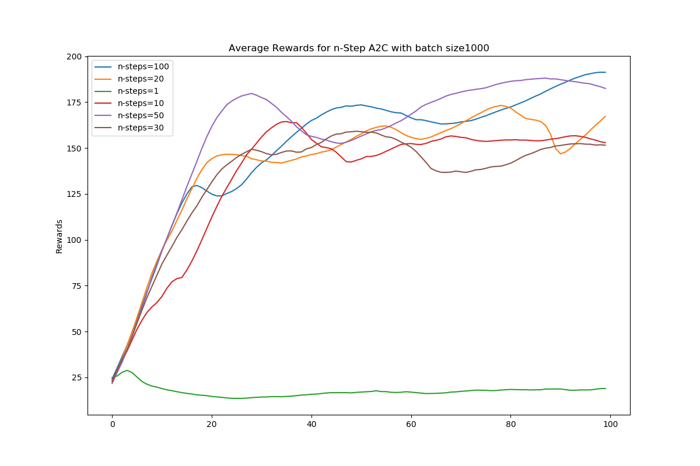

# AdvantageActorCritic-A2C-
Implementation of A2C (Model Free Deep Reinforcement Learning Algorithm)

# Explaination of n-step 
[Explanation of n-step](http://rail.eecs.berkeley.edu/deeprlcourse-fa17/f17docs/lecture_5_actor_critic_pdf.pdf)

# Shortcoming

# Results:
Comparition of standard A2C and n-step A2c
